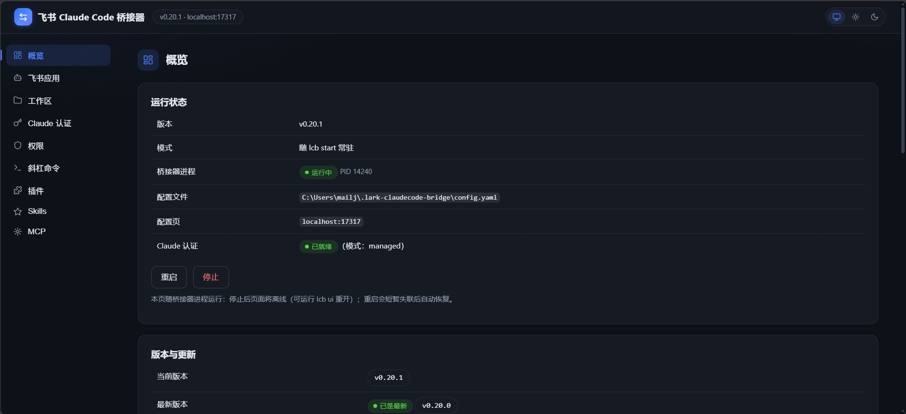
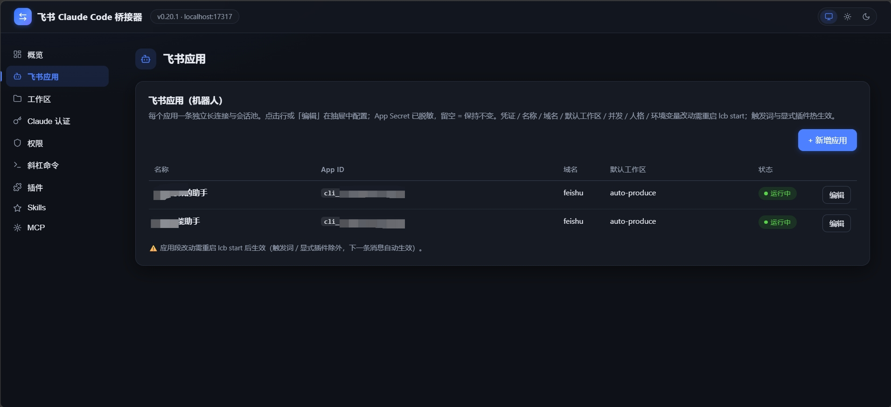

# lark-claudecode-bridge

飞书 ↔ Claude Code 桥接器：在飞书里遥控本机 Claude Code。
写操作以卡片按钮确认（长连接回调），结果文本与产出文件回传飞书。
**无需公网 IP、无需内网穿透；无需预装 Claude Code CLI，一键安装 + 网页配置即可使用。**



## 快速开始

### 前置条件

1. Node.js ≥ 20
2. Claude 认证（二选一，详见[认证双模式](#认证双模式inherit--managed)）：
   - **bridge 托管（推荐，免本机登录）**：准备 `ANTHROPIC_API_KEY`（官方）或 `ANTHROPIC_AUTH_TOKEN` + `ANTHROPIC_BASE_URL`（第三方中转端点），在配置页填写即可
   - **继承本机**：本机已 `claude login`（任意鉴权方式），桥接器自动共享 `~/.claude` 全套配置

### 安装

```bash
npm install -g @jesonliu/lark-claudecode-bridge
lcb start
```

首次运行 `lcb start` 检测到没有配置时，会自动打开浏览器进入配置页（`http://127.0.0.1:17317`）：填飞书凭证 → 选认证方式 → 完成后重新 `lcb start` 即可使用。

偏好命令行问答的也可以用 `lcb setup`（两者产物等价）。配置页也可单独启动：`lcb ui`（不启动机器人，可与运行中的桥接器共存）。

### 飞书应用配置（图文）

1. https://open.feishu.cn → 创建企业自建应用 → 添加「机器人」能力
2. 权限管理开通：`im:message`（含读取单聊消息，回复引用拼接用）、`im:message:send_as_bot`、`im:resource`（接收图片用）、`contact:user.base:readonly`、`application:app_slash_command:write` / `application:app_slash_command:read`（斜杠命令同步用）、`cardkit:card:write`（建议开通：卡片局部刷新；不开自动降级为整卡更新，功能不缺）
3. 事件与回调 → 事件配置 → 订阅方式选「使用长连接接收事件」→ 添加 `im.message.receive_v1`
4. 事件与回调 → 回调配置 → 订阅方式选「使用长连接接收回调」→「已订阅的回调」点「添加回调」，添加「卡片回传交互」（`card.action.trigger`）
5. 凭证与基础信息 → 复制 App ID / App Secret
6. 版本管理与发布 → 创建版本并发布，管理员审核通过
7. `lcb start`（首次自动进配置页）或 `lcb setup` 填入凭证 → 私聊机器人发「/help」

> 飞书权限开通后，需在飞书开发者后台创建新版本并发布，然后重启 该bridge 才生效。

## 首次使用

- 每个机器人应用的**首位发消息用户免配对**，自动成为 admin
- 后续新用户收到 6 位配对码（15 分钟内有效）：在 `lcb start` 的运行终端输入该码回车，或另开终端 `lcb pair <code>` 批准——写盘后自动生效，无需重启

## Web 配置页

配置页随桥接器常驻 `http://127.0.0.1:17317`（也可 `lcb ui` 单独启动，写盘后运行中的桥接器自动拾取可热字段）。共 9 个配置页签：

**概览** —— 桥接器进程启停 / 重启 / 后台运行、版本检查与一键更新、各机器人应用运行状态。


**飞书应用** —— 多机器人管理：App ID / Secret（脱敏回显）、默认工作区、并发上限、人格补充（`append_system_prompt`）、触发词、环境变量。

 

**工作区** —— 工作区白名单（名称 / 路径）与全局默认工作区，改动热生效。

**Claude 认证** —— inherit / managed 双模式切换、认证凭证（API Key / Auth Token / Base URL）、模型、厂商档案（多套凭证一键切换）、托管环境变量。


**权限** —— 免确认工具白名单（`permissions.allow_tools`）与危险命令黑名单，保存后热生效。

**斜杠命令** —— 把内置命令（`/new` `/status` …）+ 自定义透传命令一键同步为飞书输入框斜杠指令（输入 `/` 弹面板，选中后可继续输入描述再发送）。

**插件** —— Claude Code 插件清单（启停 / 卸载，本机 `~/.claude` 与托管目录带来源标记）、从 marketplace 安装、管理市场。

**Skills** —— 四来源技能聚合清单（本机用户级 / bridge 托管 / 工作区项目级 / 插件内只读），支持新建、删除、zip 导入。

**MCP** —— MCP Servers 管理（命令方式或 JSON 配置添加）、状态探测、抽屉查看 env 引用展开值；任务级热生效。


## lcb 命令

| 命令 | 说明 |
|---|---|
| `lcb setup` | 引导式配置（命令行问答；与配置页产物等价，预置 permissions / server 默认段） |
| `lcb start` | 启动桥接器（前台，为每个机器人各建一条长连接 + 内嵌 Web 配置页；首次安装自动进引导；终端可直接输入配对码批准） |
| `lcb ui` | 仅启动 Web 配置页（不启动机器人；可与运行中的桥接器共存，写盘后桥接器自动拾取可热字段） |
| `lcb pair <code>` | 另开终端批准 6 位配对码 |
| `lcb app list` | 列出机器人应用 |
| `lcb app add` | 添加机器人应用（交互式；旧单应用配置会自动升级为多应用格式，重启后生效） |
| `lcb app remove <名字\|app_id>` | 删除机器人应用（最后一个不可删；其会话分片与落盘目录保留待人工清理） |
| `lcb ws add <名字> <路径>` | 添加工作区（路径需已存在；增量写回，保留 config.yaml 注释） |
| `lcb ws remove <名字>` | 删除工作区（默认工作区被删时自动回退；apps 里的引用联动清理） |
| `lcb ws list` | 列出工作区（`*` 为默认） |
| `lcb version` | 查看版本 |

> **热生效**：桥接器运行中执行 `lcb ws add / remove`，下一条消息到达时自动重读配置，无需重启（apps 应用列表、凭证与 `concurrency` 改动除外，需重启）。

## 命令速查（飞书里发给机器人）

| 命令 | 说明 |
|---|---|
| /new | 开新会话（历史保留，`/resume` 可随时切回） |
| /resume | 列出/恢复历史会话（`/resume <编号>` 恢复指定会话；列表标注当前续接的会话） |
| /stop | 停止当前任务 |
| /status | 当前状态 |
| /ws list / /ws use \<名字\> | 工作区（切换仅 admin 可用） |
| /model | 查看当前模型；`/model <名字>` 通道级切换；`/model reset` 恢复默认 |
| /model-profile | 查看/切换厂商档案（多厂商凭证+模型整体切换，切换仅 admin；managed 模式下一条消息生效） |
| /plan | 计划模式开关：开启后每个任务先出计划 → 飞书卡片批准 / 按意见修改 / 放弃 → 批准后自动执行；git 仓库工作区任务收尾发汇总 diff 卡片 |
| /skills / /plugins / /mcp | 查看本会话实际加载的技能 / 插件 / MCP 服务 |
| /plugin | 插件管理：`/plugin list`（全员，含本机 ~/.claude 与托管目录两处清单）；`install/uninstall/enable/disable/marketplace …`（仅 admin，默认装 ~/.claude，`--dir=managed` 装托管目录），装好下一条消息自动加载 |
| /reload-plugins | 重载插件：清插件发现缓存，下一条消息重新扫描加载（终端命令的 bridge 等价物） |
| /help | 帮助 |
| 其它 `/xxx` | **原文透传**给 Claude Code 派发斜杠命令（如 `/superpowers:brainstorming` 触发插件技能） |

> 清单类命令（/skills 等）的数据来自最近一次会话的加载清单；刚启动还没跑过任务时，先发一条普通消息（如「你好」）再查。

## 配置文件 ~/.lark-claudecode-bridge/config.yaml

`lcb setup` 会引导生成，也可手动编辑（或用 `lcb app add / lcb ws add / remove` 增量维护，保留注释）。字段说明见仓库内 `config.example.yaml`：

```yaml
apps:                      # 多机器人：每个应用一条长连接
  - name: 主力助手          # 显示名，缺省取 app_id
    app_id: cli_xxxx        # 飞书开放平台 → 凭证与基础信息
    app_secret: xxxx
    # domain: lark          # 国际版 Lark 才需要
    # default_workspace: demo   # 该机器人的默认工作区
    # concurrency: 2        # 该机器人的并发上限
    # append_system_prompt: '你是我的素材收集助手'   # 人格补充（多机器人差异化定位的主要手段）
    # env:                  # per-app 环境变量（注意 ~/.claude/settings.json 的 env 优先级更高，
    #                         此处适合放 settings.json 里没有的键）
    #   SOME_PLUGIN_KEY: xxx
workspaces:                # 工作区白名单（列表全局共享；「当前用哪个」per-app 隔离）
  - name: demo
    path: F:\workspace\demo
defaults:
  workspace: demo
concurrency: 3             # 通道间并发上限（未单独配置的 app 沿用）
# permissions:             # 工具白名单（整块可选；setup / 配置页新建时预置完整默认值，页面可增删）
#   allow_tools:           # 免确认直通工具；配置即整体替换内置默认
#                          # 内置默认：Read/Glob/Grep/LS/TodoRead/TodoWrite/WebFetch/WebSearch/Bash
#   dangerous_commands:    # Bash 危险命令正则（不区分大小写），命中弹确认卡
#   - 'rm\s+-rf'           # 内置默认覆盖 rm -rf/sudo/git push --force/git reset --hard/mkfs/dd if=/
#                          #   chmod 777/管道执行远程脚本/shutdown 等
# server:                  # Web 配置页（随 lcb start 常驻；也可 lcb ui 单独启动）
#   enabled: true          # 缺省 true；false 则不启动
#   host: 127.0.0.1        # 仅绑回环（改非回环 = 局域网可见，注意安全）
#   port: 17317
# claude:                  # 认证双模式；缺省 = inherit（共享本机 ~/.claude）
#   mode: managed          # managed = bridge 托管（无需本机 claude login）
#   auth_token: sk-xxx     # ANTHROPIC_AUTH_TOKEN（中转站常用；与 api_key 二选一）
#   # api_key: sk-ant-xxx  # ANTHROPIC_API_KEY（官方）
#   base_url: https://relay.example   # 中转站端点；官方留空
#   model: claude-sonnet-5 # 写入托管目录 settings.json
# slash_commands:          # 飞书斜杠命令同步；内置命令恒参与，此处为自定义透传命令
#   extra:
#     - command: produce
#       description: 内容生产流程
#       icon: skill_outlined
# transcripts:             # 对话落盘清理策略；缺省 = 永久保留
#   retention_days: 90
# session:                 # 会话行为微调
#   context_remind_tokens: 150000   # 上下文超长提醒阈值（tokens）；0 = 关闭；改后热生效
```

### 认证双模式（inherit / managed）

| | inherit（缺省） | managed |
|---|---|---|
| 认证来源 | 本机 `~/.claude`（`claude login` 或其 settings.json） | config.yaml `claude` 段 → 写入 `~/.lark-claudecode-bridge/claude/settings.json` |
| 适用 | 本机已在用 Claude Code 的用户 | 干净机器 / 不想动本机配置；配 API Key 或中转站 Token |
| 模型 / MCP / skills / 插件 | 继承 `~/.claude` 全套，无须二次配置 | 全部落在托管目录，与本机 `~/.claude` 完全隔离；已启用插件双目录合并加载 |
| 切换 | 改 `claude.mode` 后**重启**生效 | 同 |

配置页「Claude 认证」tab 可视化切换；managed 模式下认证 / 模型改动保存后即对后续任务生效（无需重启）。多个机器人共享同一套 Claude 配置，会话池与并发各自独立。

## 常驻运行

- **Windows**：任务计划程序建「开机时启动」任务，程序指向 `windows-start.bat`（先放到固定位置，如 `C:\tools\lcb\windows-start.bat`）
- **macOS**：把 `com.lark-claudecode-bridge.plist` 放到 `~/Library/LaunchAgents/`，然后 `launchctl bootstrap gui/$(id -u) ~/Library/LaunchAgents/com.lark-claudecode-bridge.plist`
- **Linux**：把 `lark-claudecode-bridge.service` 放到 `~/.config/systemd/user/`，然后 `systemctl --user daemon-reload && systemctl --user enable --now lark-claudecode-bridge`

模板文件见 [deploy/](deploy/)（npm 包内同路径）。

## ⚠️ 安全须知（必读）

本机 Claude Code 是共用资源：白名单用户可通过确认卡片让它在你电脑执行任意命令。
请只批准信任的人；工作区白名单、用户白名单、写操作确认三道闸不要关闭。

**隐私提醒**：对话全文（含代码、文件路径）明文落盘于 `~/.lark-claudecode-bridge/transcripts/`；`config.yaml` 中的 `app_secret` 与 `apps[].env` 值同样为明文。请自行控制该目录与文件的访问权限，并按需配置 `transcripts.retention_days` 保留期。

## 已知限制

1. **Linux 上 >10 文件不打 zip**：文件打包依赖 bsdtar 的 zip 容器支持（Windows 10+ / macOS 自带），Linux 的 GNU tar 会自动退化为逐个上传文件（功能不丢，只是消息条数多）。
2. **共享 ~/.claude 的副作用**：本机 user 级 hooks 也会在机器人任务里执行（含阻断型 PostToolUse hook）；`apps[].env` 的同名键会被 `~/.claude/settings.json` 的 `env` 覆盖。
3. **多机器人总并发 = 各应用并发之和**：N 个机器人同时满载时会同时跑 Σ(concurrency) 个 Claude Code 子进程，机器吃紧可按 app 调低。
4. **配置页默认仅本机可访问**（127.0.0.1）：改 `server.host` 放开到局域网意味着页面可读写全部凭证，请仅在可信网络使用。

## 开发

```bash
npm install
npm test          # vitest 全量单测
npm run build     # tsc → dist/
node dist/bin/lcb.js version
```

## License

MIT
